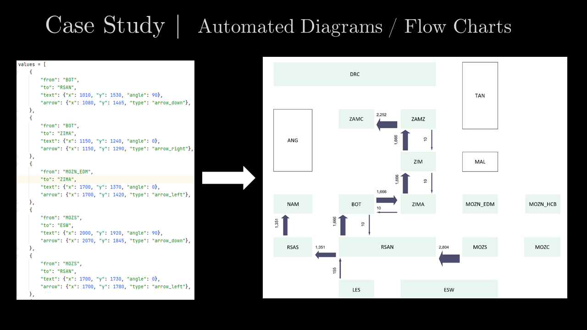

# Background
For a recent assignment I created an automated daily analysis of the power flow in the Southern African Power Grid. 

The power flow is dynamic, and I could not really get it to work with diagramming software. Using Python and the Pillow image processing lib I defined each of the elements (using a dictionary, should really move it into a TOML file to generalise) I needed on the Image (Blocks, Up Arrows, Down Arrows etc.). 

Based on the analysis the boxes and arrows were scaled and added to the image canvas. Some text is added and viola we have a daily automated flow diagram produced using the Pillow module. A cronjob on the server fires off the analysis every day, generates a PDF report with the included image and mails it to the authorised recipients.