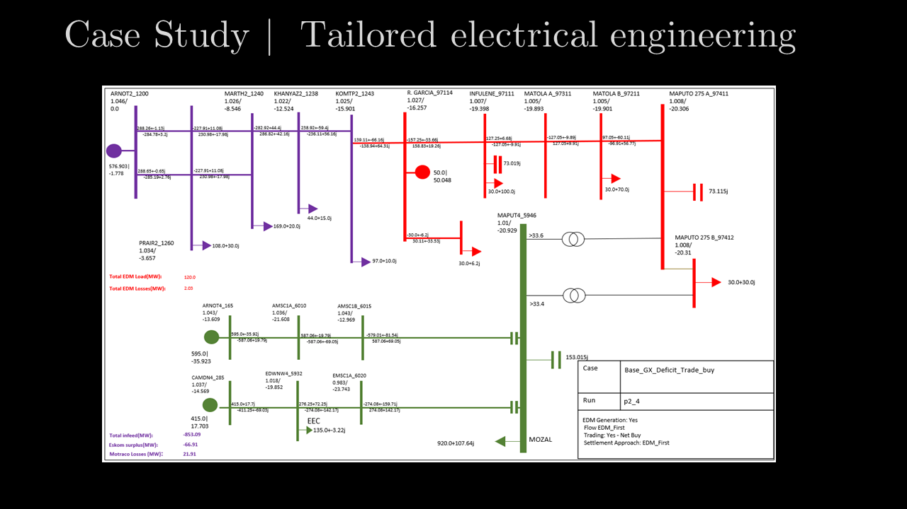

# Background

Professional Load (Power)Flow packages are expensive, and mostly used by large industrial companies, mines as well as electrical utilities. Costs can be in the tens to hundreds of thousands of dollars. These packages have so much functionality and interface options, that although it seems expensive, it is most probably worth it.

But sometimes, these costs can be prohibitive if you only want to maybe run a specific loadflow with many cases and options. 

## Enter Python.
For a recent project a PPS/E case file was translated into a PandaPower and PyPSA equivalent case using a custom Python script. (PSS/E use the per-unit system in a 100MVA base where PandaPower used R,X,B values in per km). 

The case was solved and compared with the commercial software to ensure that tight error tolerances were met and each case could now be solved iteratively using the Python base PandaPower and PyPSA.

## Graphical Output?
The major drawback however is that neither of these packages offer network single line diagramming capability. It was decided to draw the network single line diagrams in PowerPoint and then after each case is solved, the Python script transferred the Voltage, Current and other information to the PowerPoint slide. 

This approach enabled the following workflow:
- Translate the base PPS/E case into equivalent PandaPower network
- Add swing busses around the area of investigation
- Create 30 potential cases
- Solve each case
- Create Single Line diagram in PowerPoint and add case information 
- Repeat

## Was it worth it?
For this project maybe as much time went into building the workflow than maybe the cost of obtaining a short term licence to solve the same problem. To the development cost is probably close to equal than potential proprietary software cost. Now that the workflow has been established a definite return will be observed in future assignments of this nature.

## Packages Employed
* Custom PSS/E to PandaPower network translator
* [PandaPower](http://www.pandapower.org/)
* [PyPSA](https://github.com/pypsa-meets-africa/pypsa-africa)
* python-pptx
* matplotlib
* pandas