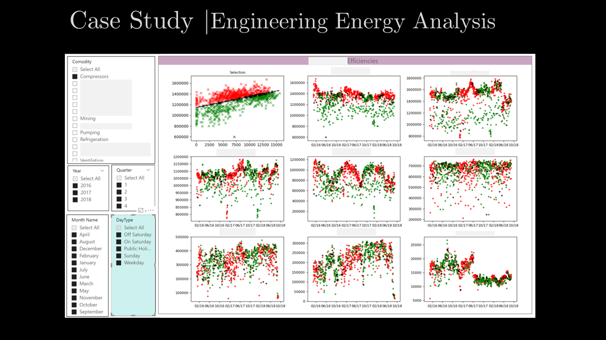

# PowerBI meets Python in Industrial Analysis

Python is a powerful tool to analyse industrial process energy consumption and predict areas of higher vs lower energy consumption.

PowerBI has the functionality to interop with Python. Once your model is developed and trained you can embed it in PowerBI and use its connection to your database with its excellent filtering capability to drill into any day, weekend, quarter or hour to see model results.

Here we are sending data from the PowerBI cube to the Python backend which in turn returns some Matplotlib graphs with the results.

Although a strong proponent of using open source software where possible, this is an example of using Python as an open source package (leveraging all of its power), but being able to integrate it into client systems and pre-configured backends.

