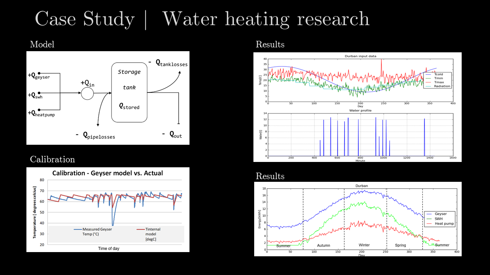

# Python in energy research
South-Africa has a range of climates and various water heating technologies (Solar vs Heatpumps) perform differently in these climates. 

For a research project a thermodynamic model of the following types of water heating options were developed:
* Normal hot water cylinder driven by a 3kW electrical element (called a geyser over here)
* Various types of heat-pumps (Different COPs and ambient performances)
* Various solar water heaters 

The client had a test bed where the electrical performance of each of these options were empirically measured.
The measured data was used to calibrate the thermodynamic model that was set up as various Objects in Python.

Once the models were calibrated it could be used to predict the performance of these options under the following conditions:
* Inland vs. Coastal (large daily temperature swings, cloud cover)
* Solar radiation
* Humidity
* Orientation
* Insulation
* Various water use patters (Small to Large and Industrial Clients.)
* Groundwater (input) temperature fluctuations.

The model solved for 8760 hours in a year.

