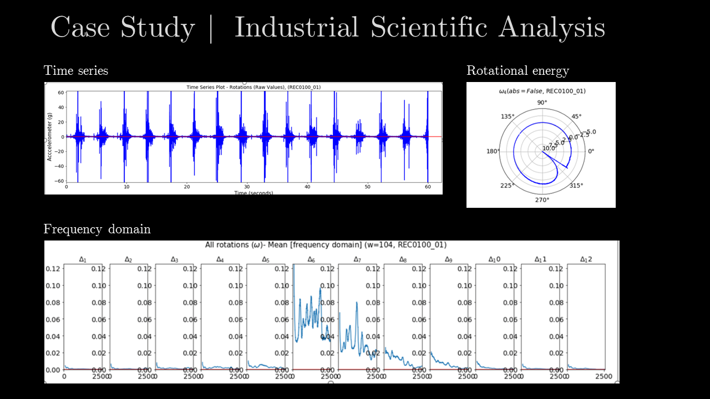

# Summary
The versatility of Python makes it possible for someone like me to build production ready web applications, automate PDF's and emails and then every now and then solve scientific problems. 

During a recent assignment, measurements from a large
rotating mass was taken using an accelerometer. The question being asked was
basically to find the angle of the mass during internal impact events and to
observe any vibrational energy.

There is not much one can learn from the time series
analysis except maybe the angular velocity of the mass. By smoothing the data
and adding it to a polar plot, the angle of internal impact can be easily
observed. 

A frequency domain analysis (FFT) gave some indication on frequencies
present in the vibrations.

Thousands of these samples were anlysed and PowerPoint slides were generated automatically
easy presentation and discussion.

 

## Modules
* Pandas, 
* Matplotlib, 
* NumPy
* python-pptx

