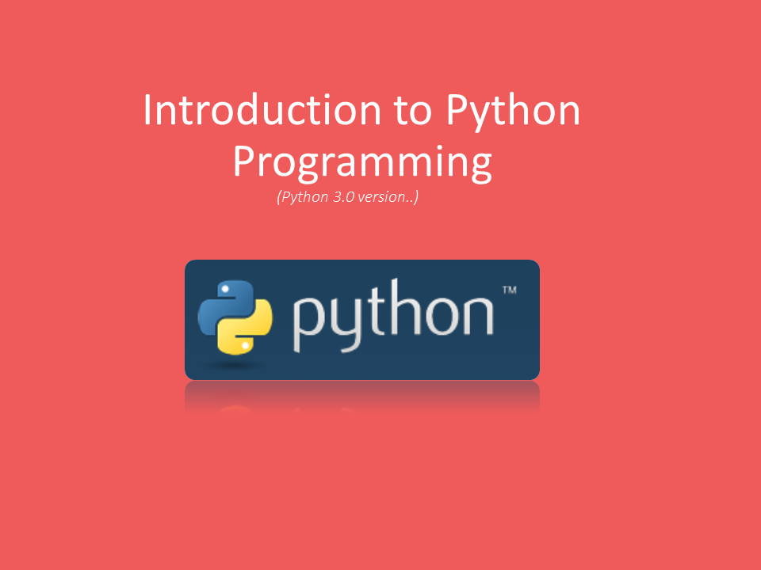
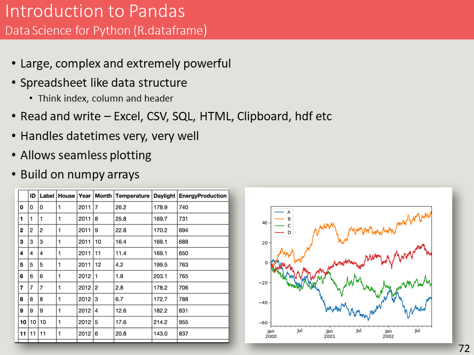

# Python training courses

I have developed and presented Python training courses to more than `200` individuals:
* school learners
* beginners
* engineering companies
* mentored individuals

# Need training?
Get in touch with me to get a tailored python training offer.

# Introduction Courses
Most courses are tailored to the needs of the clients but generally consists of:
* Installation and Editor preparation
* Variables
* Expressions
* Statements
* Conditional logic
* Iteration
* Strings
* Data Structures
* Modules 
* Files
* Classes (OOP)

# Intermediary Courses
For more experiences programmers the following content is covered in tailored one day engagements:
* Jupyter Notebooks
* Pandas for data analysis (including sqlite)
* Data visualisation using matplotlib 
* Source code control using git
* Web servers and api's
* Deployment to online hosting environment
* programming the browser (HTML, js)

  

# Specialised Courses
* Automate PDF generation
* Automate  PowerPoint, Word, Excel
* Image manipulation and generation using PIL
* GUI development using QT (Pyside2/6)
* Automated Social Media Posting

