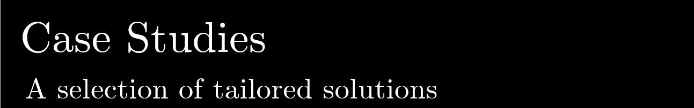

I am an electrical engineer with more that 20 years experience in
the energy supply and consulting environment.

My passion for Python development have set me down a slow but 
steady path to become a self employed full stack developer.

Most of my clients are in the engineering space although 
my largest project is an international trade application 
that is used by companies and government agencies 
around the world.

I help my clients automate the engineering tasks of:
* Data acquisition
* Data analysis
* Automated reporting in many different formats
* Tailored web applications and BI application

Below is a listing of some of the interesting work have been doing with my clients.
Almost all of the solutions have been implemented using Python.

### Download my [CV](assets/tobie_nortje_cv.pdf) here

* [International trade application](projects/international-trade-application/readme.md)
* [Tailored electrical engineering solution](projects/electrical-engineering/readme.md)
* [Mining scientific analysis automated (Fourier transforms and Polar analysis)](projects/industrial-analysis/readme.md)
* [Water heating research](projects/hot-water/readme.md)
* [Specialized email automation](projects/specialised-email/readme.md)
* Automated PDF generation
* Programatic block diagrams
* Automated social media posting
* Engineering automation
* Engineering drawings 
* Very large Engineering data sets analysis
* Automated data acquisition
* Critical analytics graphs 
* Automated PowerPoint presentations
* Mailing list integration

## Hardware projects
* Printed Circuit Board design and assembly for brick making robots

## Talks, Training and Conferences
I have presented Python talks and python courses to large companies and individuals
* PyConZa
* CSIR
* Denel
* Private Python Beginners Course
* Slides

## Tools 
* Pycharm
* VSCode
* github

## Languages and Frameworks
* Python
* Django
* js
* Vuejs
* Embedded C++ (Arduino)
* SQL dbs

# Deployment
* DigitalOcean
* Linode
* AWS
* Azure
